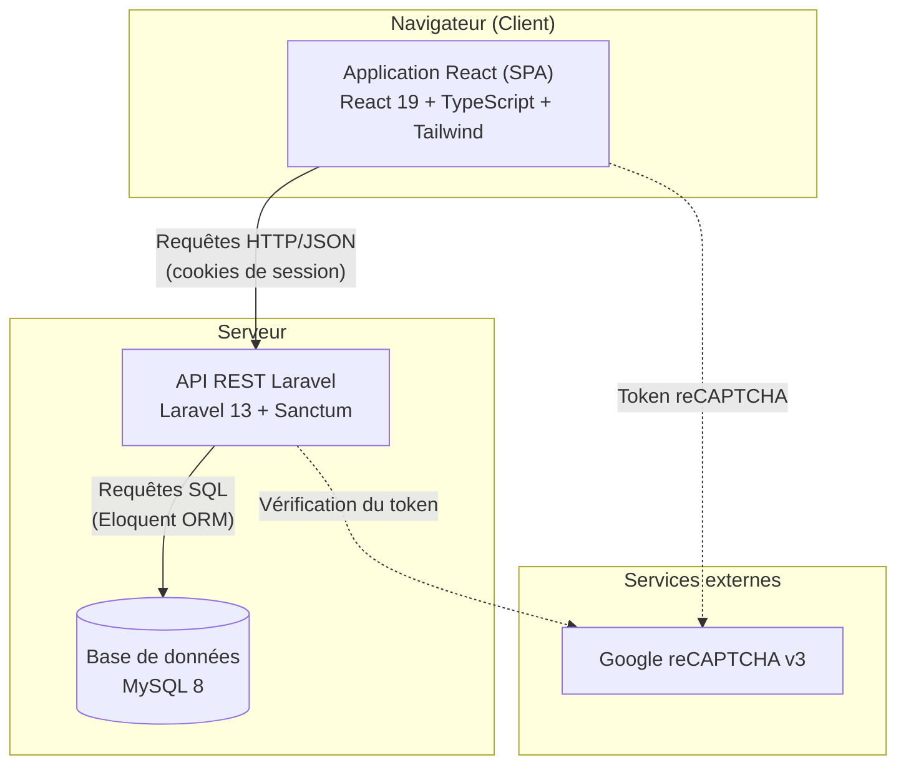
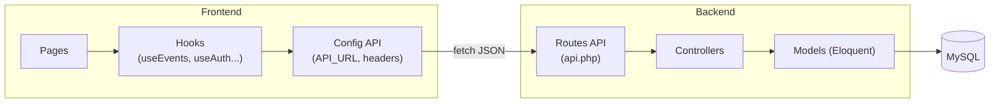
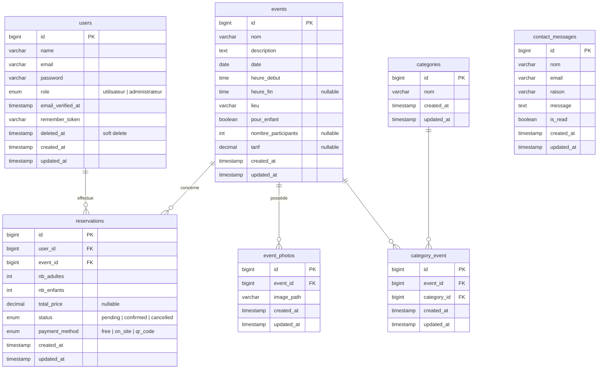
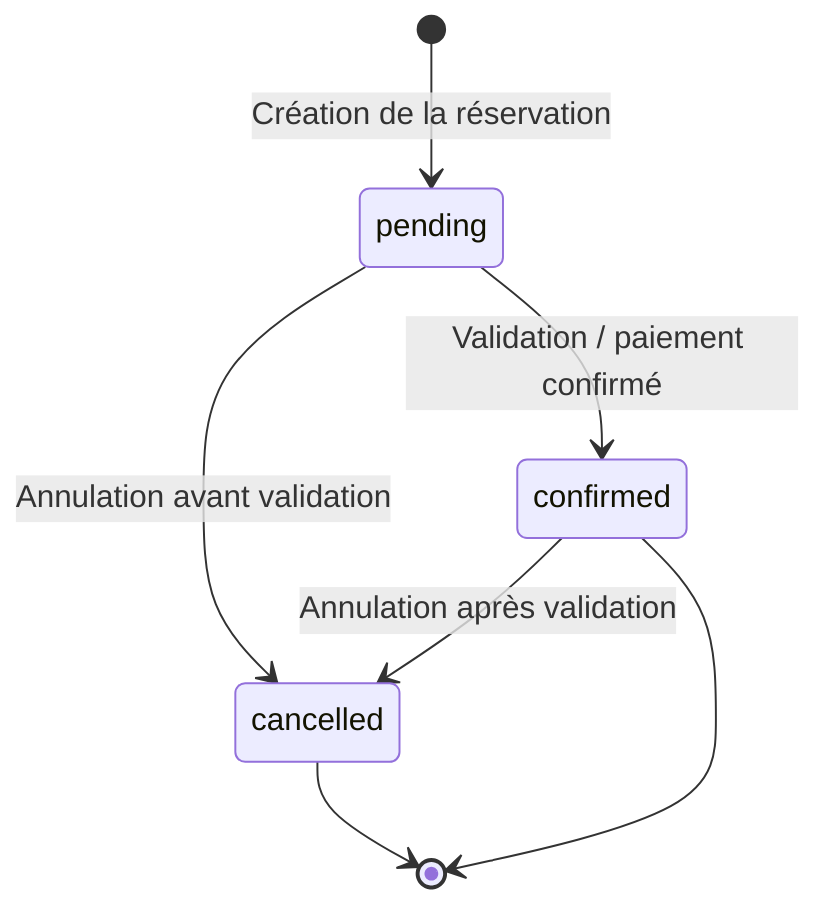

# Documentation technique — Luxafro

> Documentation interne du projet Luxafro. Destinée aux développeurs rejoignant le projet ou en assurant la maintenance.

## Sommaire

1. [Vue d'ensemble](#1-vue-densemble)
2. [Architecture générale](#2-architecture-générale)
3. [Choix technologiques](#3-choix-technologiques)
4. [Modèle de données](#4-modèle-de-données)
5. [Structure du code](#5-structure-du-code) *(à venir)*
6. [Flux de données](#6-flux-de-données) *(à venir)*
7. [Sécurité](#7-sécurité) *(à venir)*
8. [Installation et déploiement](#8-installation-et-déploiement) *(à venir)*

---

## 1. Vue d'ensemble

### 1.1 Contexte et objectifs

Luxafro est une application web développée pour une association culturelle dédiée à la promotion de la culture camerounaise. La plateforme poursuit trois objectifs principaux :

- **Présenter les événements culturels** organisés par l'association (spectacles, ateliers, rencontres, dégustations).
- **Permettre aux membres de s'inscrire** à ces événements après création d'un compte.
- **Faciliter le contact** entre les visiteurs et l'association via un formulaire dédié.

L'application distingue deux types d'utilisateurs : les **visiteurs/membres**, qui consultent les événements et s'y inscrivent, et les **administrateurs**, qui gèrent le contenu (événements, utilisateurs, messages) via un espace dédié.

### 1.2 Périmètre fonctionnel

| Domaine | Fonctionnalités |
|---|---|
| Authentification | Inscription, connexion, déconnexion, réinitialisation de mot de passe |
| Événements | Consultation de la liste, détail d'un événement, événement recommandé à la une |
| Réservations | Inscription à un événement, choix du nombre de participants et du mode de paiement |
| Contact | Envoi de messages à l'association (protégé par reCAPTCHA) |
| Administration | Gestion des utilisateurs, des événements, et des messages de contact |

### 1.3 Principes directeurs

Le projet suit quelques principes structurants qui se retrouvent dans tout le code :

- **Séparation des responsabilités** : le frontend (présentation et interactions) et le backend (logique métier et données) sont deux applications distinctes communiquant via une API REST.
- **Réutilisabilité** : la logique d'accès aux données côté frontend est encapsulée dans des hooks React réutilisables, et les composants d'interface sont conçus pour être indépendants.
- **Sécurité par défaut** : authentification par sessions sécurisées, protection CSRF systématique sur les mutations, et protection anti-bots sur les formulaires publics.

---

## 2. Architecture générale

### 2.1 Vue en couches

L'application repose sur une architecture **client-serveur découplée** : une application monopage (SPA) React communique avec une API REST Laravel, qui persiste les données dans une base MySQL.

### 2.2 Rôle de chaque couche

**Frontend (React)** — La couche de présentation. Elle gère l'affichage, les interactions utilisateur, la validation côté client et le routage entre les pages. Elle ne contient aucune logique métier sensible : toute décision importante (authentification, autorisations, validation finale) est confirmée côté serveur. Elle communique avec le backend exclusivement via des appels HTTP au format JSON.

**Backend (Laravel)** — La couche métier et d'accès aux données. Elle expose une API REST, applique les règles de validation, gère l'authentification et les autorisations, et orchestre la persistance via l'ORM Eloquent. C'est l'unique point d'autorité : le frontend lui fait des demandes, mais c'est le backend qui décide.

**Base de données (MySQL)** — La couche de persistance. Elle stocke les utilisateurs, événements, réservations, messages de contact et leurs relations. Elle n'est jamais accédée directement par le frontend.

**Services externes (Google reCAPTCHA)** — Sollicité lors de la soumission des formulaires publics. Le frontend obtient un token auprès de Google, et le backend le vérifie auprès de Google avant de traiter la requête.

### 2.3 Communication entre frontend et backend

La communication suit le modèle REST sur HTTP, avec des échanges au format JSON. Deux caractéristiques importantes :

**Authentification par cookies de session.** Plutôt que d'utiliser des tokens applicatifs (type JWT), l'application s'appuie sur les sessions Laravel via Sanctum. Après connexion, le navigateur reçoit un cookie de session qu'il renvoie automatiquement à chaque requête. Ce choix est détaillé dans la section [Choix technologiques](#3-choix-technologiques).

**Protection CSRF sur les mutations.** Toute requête qui modifie des données (POST, PUT, PATCH, DELETE) doit fournir un token CSRF, obtenu au préalable via l'endpoint `/sanctum/csrf-cookie`. Ce mécanisme est détaillé dans la section [Sécurité](#7-sécurité).

### 2.4 Conteneurisation

L'ensemble des services tourne dans des conteneurs Docker orchestrés par Docker Compose, ce qui garantit un environnement de développement identique pour tous les membres de l'équipe. Quatre services sont définis :

| Service | Conteneur | Rôle | Port |
|---|---|---|---|
| `mysql` | `luxafro_mysql` | Base de données | 3306 |
| `phpmyadmin` | `luxafro_phpmyadmin` | Interface d'administration BDD | 8081 |
| `laravel` | `luxafro_laravel` | API backend (+ Reverb) | 8000, 8080 |
| `react` | `luxafro_react` | Application frontend | 5173 |

Les services communiquent au sein d'un réseau Docker dédié (`luxafro_network`), ce qui leur permet de se joindre par leur nom de service (par exemple, Laravel joint la base via l'hôte `mysql`).

---

## 3. Choix technologiques

Cette section justifie les principaux choix techniques du projet. Chaque décision répond à un besoin précis et a été pesée face à ses alternatives.

### 3.1 Frontend : React + TypeScript + Tailwind CSS

**React** a été retenu pour construire l'interface sous forme d'application monopage (SPA). Son modèle à base de composants favorise la réutilisation et facilite la maintenance : un même composant (par exemple une carte d'événement ou un spinner) est défini une fois et utilisé partout. Son large écosystème et sa popularité en font également un choix pérenne et facile à reprendre pour un nouveau développeur.

**TypeScript** ajoute un typage statique à JavaScript. Dans ce projet, il sécurise notamment les échanges avec l'API : les structures de données renvoyées par le backend (événements, réservations, messages) sont décrites par des types (`Event`, `Reservation`, `ContactMessage`), ce qui permet de détecter les erreurs dès l'écriture du code plutôt qu'à l'exécution.

**Tailwind CSS** est un framework CSS utilitaire qui permet de styliser directement dans le balisage via des classes. Il assure une cohérence visuelle (mêmes échelles d'espacement, de couleurs, d'arrondis) et accélère le développement en évitant de jongler entre fichiers CSS et composants.

**Vite** sert d'outil de build et de serveur de développement. Il offre un démarrage quasi instantané et un rechargement à chaud très rapide, ce qui améliore le confort de développement par rapport à des outils plus anciens.

### 3.2 Backend : Laravel + Sanctum

**Laravel** est un framework PHP mature qui structure l'application backend. Il apporte de nombreux mécanismes prêts à l'emploi utilisés dans le projet : système de routage (`api.php`), ORM Eloquent pour l'accès aux données, validation des requêtes, middlewares pour le contrôle d'accès, et migrations pour versionner le schéma de base. Sa convention forte (« convention over configuration ») rend le code prévisible et lisible.

**Laravel Sanctum** gère l'authentification. Il a été configuré en **mode session** (et non en mode token applicatif), un choix détaillé ci-dessous. Sanctum s'intègre nativement avec le système de cookies et de protection CSRF de Laravel, ce qui en fait la solution la plus directe pour une SPA et une API hébergées sur le même domaine.

### 3.3 Base de données : MySQL

**MySQL** a été choisi comme système de gestion de base de données relationnelle. Le modèle de données du projet est fortement relationnel (un utilisateur possède des réservations, une réservation concerne un événement, un événement appartient à des catégories), ce qui correspond précisément aux forces d'une base relationnelle : intégrité référentielle, jointures, contraintes. MySQL est par ailleurs robuste, largement documenté, et bien supporté par Laravel via Eloquent.

### 3.4 Authentification : sessions plutôt que JWT

Le choix du mécanisme d'authentification est structurant. Deux approches étaient envisageables.

**Les sessions** (choix retenu) : après connexion, le serveur crée une session et renvoie un cookie au navigateur. Ce cookie est renvoyé automatiquement à chaque requête, et le serveur vérifie la session correspondante.

**Les tokens JWT** : après connexion, le serveur génère un jeton signé que le client stocke et renvoie manuellement dans un en-tête à chaque requête. Le serveur vérifie la signature du jeton sans interroger de base.

| Critère | Sessions (retenu) | JWT |
|---|---|---|
| Adapté à une SPA même domaine | ✅ Idéal | Possible mais surdimensionné |
| Révocation immédiate | ✅ (destruction de la session) | ❌ (valide jusqu'à expiration) |
| Protection CSRF | Gérée nativement par Sanctum | À gérer autrement |
| Stockage côté client | Cookie httpOnly (sûr) | localStorage (risque XSS) ou cookie |
| Complexité (refresh token, etc.) | Faible | Élevée |
| Pertinent pour API publique / mobile | Moins adapté | ✅ |

**Justification du choix.** L'application est une SPA et une API hébergées sur le même domaine, sans application mobile ni API publique destinée à des tiers. C'est exactement le cas d'usage pour lequel Sanctum en mode session a été conçu. Ce mode offre une révocation immédiate des accès, une protection CSRF intégrée, et un stockage du jeton de session dans un cookie `httpOnly` inaccessible au JavaScript — donc protégé contre le vol par injection de script (XSS). JWT n'aurait apporté de bénéfice réel que dans le cas d'une API consommée par des clients tiers ou une application mobile, scénarios absents du périmètre. À l'inverse, JWT aurait introduit une complexité superflue (gestion de l'expiration et du renouvellement des jetons) et la perte de la révocation instantanée.

### 3.5 Protection anti-bots : reCAPTCHA v3

Les formulaires publics (à commencer par le formulaire de contact) sont exposés aux soumissions automatisées par des bots. **Google reCAPTCHA v3** a été retenu parmi les trois versions disponibles.

| Critère | v2 case à cocher | v2 invisible | v3 (retenu) |
|---|---|---|---|
| Interaction utilisateur | Obligatoire | Possible | Aucune |
| Accessibilité | Moyenne | Bonne | Excellente |
| Granularité de la décision | Binaire | Binaire | Score 0 à 1 |
| Risque de friction pour l'utilisateur | Élevé | Moyen | Faible |

**Justification du choix.** Le formulaire de contact est un canal de communication essentiel, ouvert aux visiteurs non authentifiés. Toute friction (case à cocher, sélection d'images) risquerait de décourager des envois légitimes et poserait des problèmes d'accessibilité. La version 3 fonctionne de manière totalement invisible : elle analyse le comportement de l'utilisateur en arrière-plan et retourne un score de probabilité (de 0.0 pour un bot certain à 1.0 pour un humain certain). Le backend décide ensuite, selon un seuil configurable (fixé à 0.5), d'accepter ou de rejeter la soumission. Ce fonctionnement préserve l'expérience utilisateur tout en filtrant les soumissions automatisées, et son seuil ajustable permet d'affiner la sensibilité après mise en production sans modifier le code. Le détail de l'intégration figure dans la section [Sécurité](#7-sécurité).

### 3.6 Synthèse

| Besoin | Technologie | Raison principale |
|---|---|---|
| Interface réactive et maintenable | React + TypeScript | Composants réutilisables, typage sûr |
| Cohérence visuelle rapide | Tailwind CSS | Classes utilitaires, design system implicite |
| API structurée et sécurisée | Laravel + Sanctum | Conventions fortes, sécurité intégrée |
| Données relationnelles | MySQL | Intégrité référentielle, jointures |
| Authentification SPA même domaine | Sessions (Sanctum) | Révocation immédiate, CSRF natif, cookie httpOnly |
| Protection formulaires publics | reCAPTCHA v3 | Invisible, accessible, score ajustable |

---

## 4. Modèle de données

### 4.1 Vue d'ensemble

La base de données `luxafro` contient deux catégories de tables :

- Les **tables métier**, propres à l'application, qui modélisent le domaine (utilisateurs, événements, réservations, etc.).
- Les **tables techniques**, générées automatiquement par Laravel pour son fonctionnement interne (cache, files d'attente, sessions, migrations). Elles ne sont pas décrites en détail ici car elles ne relèvent pas de la logique métier.

Cette section se concentre sur les tables métier.

### 4.2 Diagramme entité-association

> Note : `contact_messages` n'a aucune relation avec les autres tables. Un message de contact peut être envoyé par n'importe quel visiteur, y compris non authentifié — il ne référence donc pas d'utilisateur.

### 4.3 Description des tables

#### users

Stocke les comptes utilisateurs. Le champ `role` (énumération `utilisateur` / `administrateur`) détermine les droits d'accès : seuls les administrateurs accèdent à l'espace de gestion. La présence de `deleted_at` indique l'usage du **soft delete** : un utilisateur supprimé n'est pas effacé physiquement mais marqué comme supprimé, ce qui préserve l'intégrité des données liées (réservations passées notamment). Les champs `email_verified_at` et `remember_token` sont des mécanismes standards de Laravel (vérification d'email, fonctionnalité « se souvenir de moi »).

#### events

Cœur du domaine, cette table décrit les événements culturels. Les champs `heure_fin`, `nombre_participants` et `tarif` sont nullables, ce qui autorise des événements sans heure de fin définie, sans limite de places, ou gratuits. Le booléen `pour_enfant` indique si l'événement est adapté aux enfants — information exploitée par le frontend pour afficher (ou non) un compteur d'enfants lors de la réservation.

#### categories

Liste des catégories thématiques (par exemple : musique, gastronomie, danse). Une table volontairement simple, reliée aux événements par une relation plusieurs-à-plusieurs.

#### category_event

Table **pivot** matérialisant la relation plusieurs-à-plusieurs entre `events` et `categories` : un événement peut appartenir à plusieurs catégories, et une catégorie regroupe plusieurs événements. Les deux clés étrangères sont en `ON DELETE CASCADE` : si un événement ou une catégorie est supprimé, les associations correspondantes le sont aussi automatiquement.

#### event_photos

Stocke les chemins des images associées à un événement (`image_path`). La relation est un-à-plusieurs : un événement peut avoir plusieurs photos. La suppression d'un événement entraîne la suppression de ses photos (`ON DELETE CASCADE`).

#### reservations

Enregistre les inscriptions des utilisateurs aux événements. C'est la table relationnelle centrale, reliée à la fois à `users` et `events`. Plusieurs champs méritent attention :

- `nb_adultes` et `nb_enfants` : composition de la réservation (valeurs par défaut 1 et 0).
- `total_price` : montant calculé, nullable pour les événements gratuits.
- `status` : cycle de vie de la réservation (`pending`, `confirmed`, `cancelled`).
- `payment_method` : mode de paiement (`free`, `on_site`, `qr_code`).

Les deux clés étrangères sont en `ON DELETE CASCADE` : supprimer un utilisateur ou un événement supprime les réservations associées.

#### contact_messages

Stocke les messages envoyés via le formulaire de contact public. Le booléen `is_read` (faux par défaut) permet à l'administration de distinguer les messages traités de ceux en attente. Comme indiqué plus haut, cette table est autonome : elle ne référence aucun utilisateur, puisque le formulaire est ouvert à tous.

### 4.4 Relations principales

| Relation | Type | Description |
|---|---|---|
| `users` → `reservations` | un-à-plusieurs | Un utilisateur peut avoir plusieurs réservations |
| `events` → `reservations` | un-à-plusieurs | Un événement peut recevoir plusieurs réservations |
| `events` → `event_photos` | un-à-plusieurs | Un événement peut avoir plusieurs photos |
| `events` ↔ `categories` | plusieurs-à-plusieurs | Via la table pivot `category_event` |

### 4.5 Cycle de vie d'une réservation

Le champ `status` de la table `reservations` suit un cycle de vie simple, du moment de l'inscription jusqu'à sa confirmation ou son annulation.

### 4.6 Note de cohérence frontend / backend

Une divergence mineure existe entre le type TypeScript `PaymentMethod` côté frontend et l'énumération réelle en base :

- **Base de données** (`reservations.payment_method`) : `free`, `on_site`, `qr_code`
- **Type TypeScript** (`Reservation.ts`) : `on_site`, `qr_code`

La valeur `free` (paiement pour un événement gratuit) est présente en base mais absente du type frontend. De même, le type `ReservationStatus` côté frontend inclut une valeur `paid` qui n'apparaît pas dans l'énumération de la base (`pending`, `confirmed`, `cancelled`). Il est recommandé d'aligner ces définitions pour éviter toute incohérence : soit en ajoutant les valeurs manquantes au type TypeScript, soit en ajustant l'énumération en base selon le comportement réellement souhaité.
