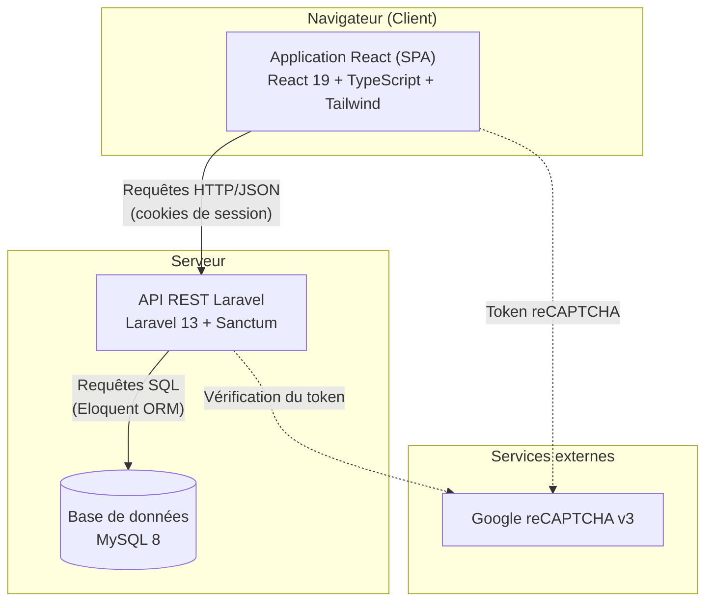
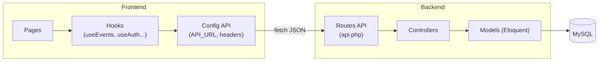
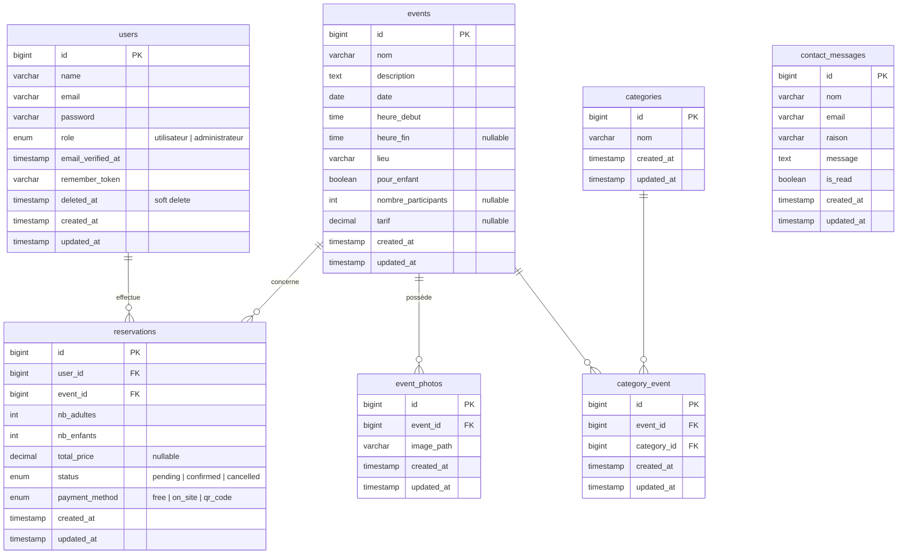
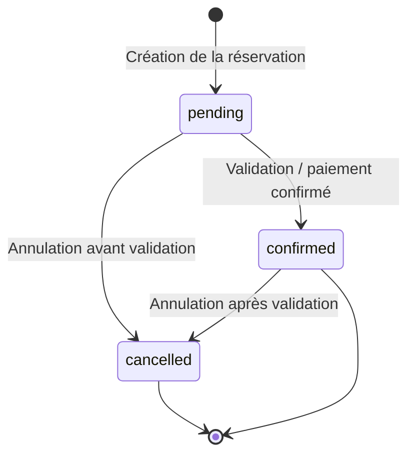
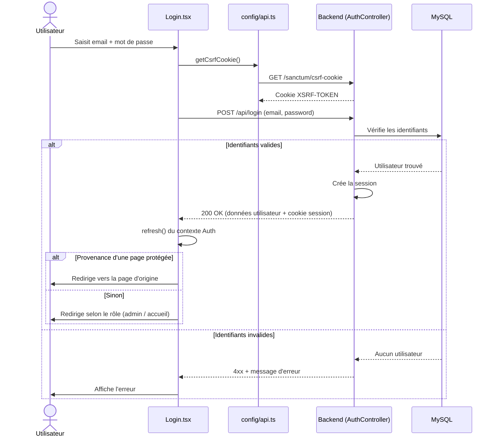
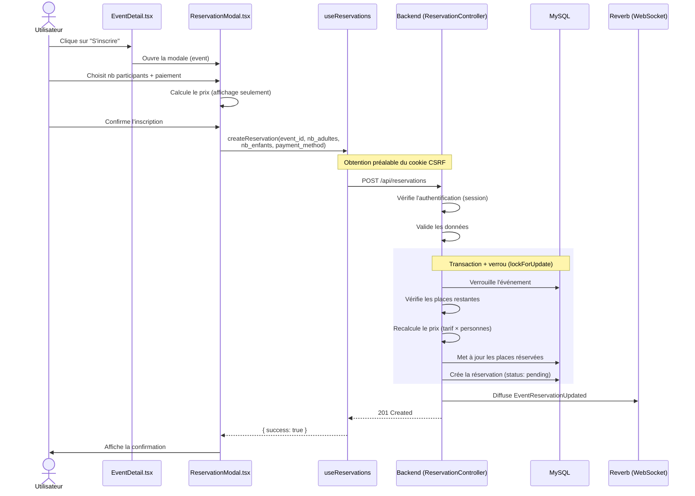
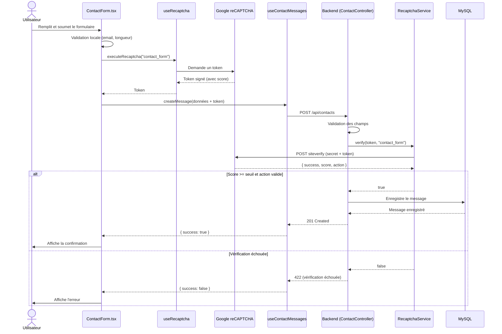
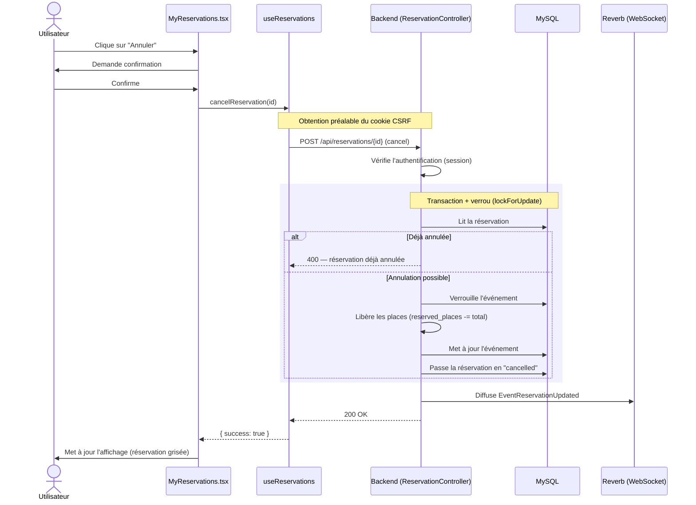
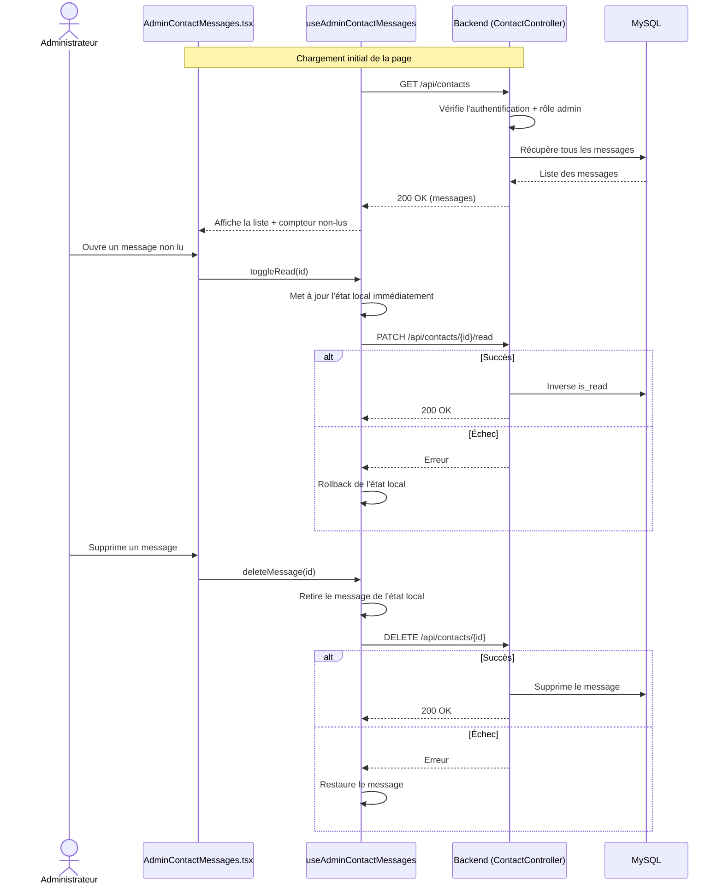
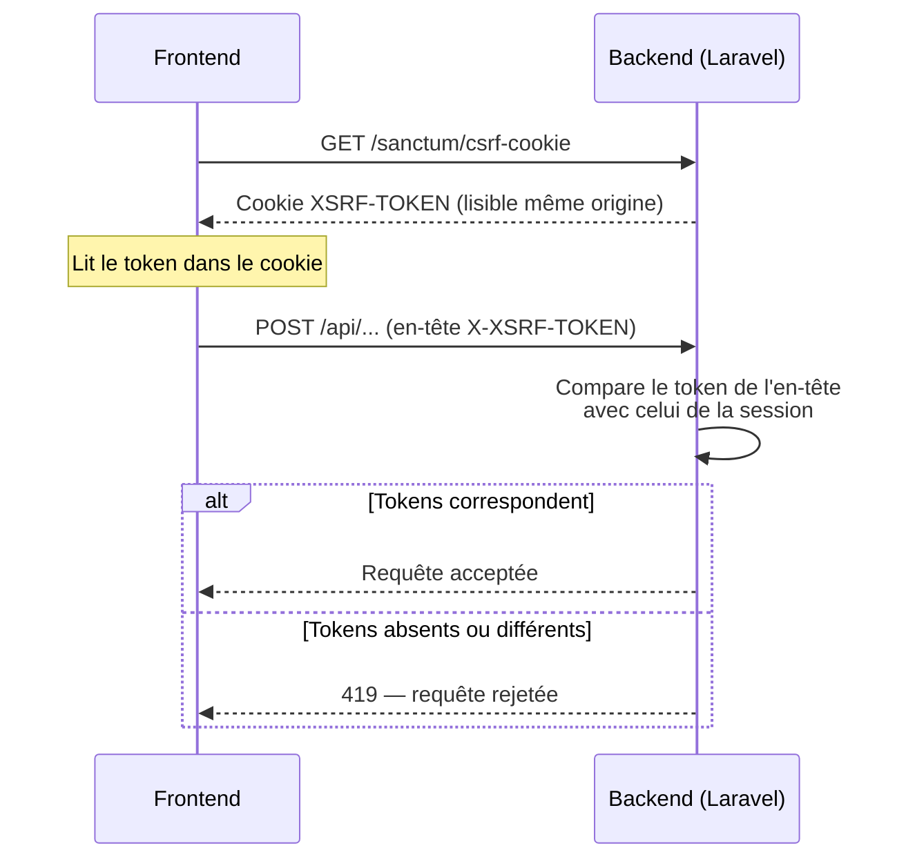

# Documentation technique — Luxafro

> Documentation interne du projet Luxafro. Destinée aux développeurs rejoignant le projet ou en assurant la maintenance.

## Sommaire

1. [Vue d'ensemble](#1-vue-densemble)
2. [Architecture générale](#2-architecture-générale)
3. [Choix technologiques](#3-choix-technologiques)
4. [Modèle de données](#4-modèle-de-données)
5. [Structure du code](#5-structure-du-code)
6. [Flux de données](#6-flux-de-données)
7. [Sécurité](#7-sécurité)
8. [Évolutions prévues](#8-évolutions-prévues)

---

## 1. Vue d'ensemble

### 1.1 Contexte et objectifs

Luxafro est une application web développée pour une association culturelle dédiée à la promotion de la culture camerounaise. La plateforme poursuit trois objectifs principaux :

- **Présenter les événements culturels** organisés par l'association (spectacles, ateliers, rencontres, dégustations).
- **Permettre aux membres de s'inscrire** à ces événements après création d'un compte.
- **Faciliter le contact** entre les visiteurs et l'association via un formulaire dédié.

L'application distingue deux types d'utilisateurs : les **visiteurs/membres**, qui consultent les événements et s'y inscrivent, et les **administrateurs**, qui gèrent le contenu (événements, utilisateurs, messages) via un espace dédié.

### 1.2 Périmètre fonctionnel

| Domaine | Fonctionnalités |
|---|---|
| Authentification | Inscription, connexion, déconnexion, réinitialisation de mot de passe |
| Événements | Consultation de la liste, détail d'un événement, événement recommandé à la une |
| Réservations | Inscription à un événement, choix du nombre de participants et du mode de paiement |
| Contact | Envoi de messages à l'association (protégé par reCAPTCHA) |
| Administration | Gestion des utilisateurs, des événements, et des messages de contact |

### 1.3 Principes directeurs

Le projet suit quelques principes structurants qui se retrouvent dans tout le code :

- **Séparation des responsabilités** : le frontend (présentation et interactions) et le backend (logique métier et données) sont deux applications distinctes communiquant via une API REST.
- **Réutilisabilité** : la logique d'accès aux données côté frontend est encapsulée dans des hooks React réutilisables, et les composants d'interface sont conçus pour être indépendants.
- **Sécurité par défaut** : authentification par sessions sécurisées, protection CSRF systématique sur les mutations, et protection anti-bots sur les formulaires publics.

---

## 2. Architecture générale

### 2.1 Vue en couches

L'application repose sur une architecture **client-serveur découplée** : une application monopage (SPA) React communique avec une API REST Laravel, qui persiste les données dans une base MySQL.



### 2.2 Rôle de chaque couche

**Frontend (React)** — La couche de présentation. Elle gère l'affichage, les interactions utilisateur, la validation côté client et le routage entre les pages. Elle ne contient aucune logique métier sensible : toute décision importante (authentification, autorisations, validation finale) est confirmée côté serveur. Elle communique avec le backend exclusivement via des appels HTTP au format JSON.

**Backend (Laravel)** — La couche métier et d'accès aux données. Elle expose une API REST, applique les règles de validation, gère l'authentification et les autorisations, et orchestre la persistance via l'ORM Eloquent. C'est l'unique point d'autorité : le frontend lui fait des demandes, mais c'est le backend qui décide.

**Base de données (MySQL)** — La couche de persistance. Elle stocke les utilisateurs, événements, réservations, messages de contact et leurs relations. Elle n'est jamais accédée directement par le frontend.

**Services externes (Google reCAPTCHA)** — Sollicité lors de la soumission des formulaires publics. Le frontend obtient un token auprès de Google, et le backend le vérifie auprès de Google avant de traiter la requête.

### 2.3 Communication entre frontend et backend

La communication suit le modèle REST sur HTTP, avec des échanges au format JSON. Deux caractéristiques importantes :

**Authentification par cookies de session.** Plutôt que d'utiliser des tokens applicatifs (type JWT), l'application s'appuie sur les sessions Laravel via Sanctum. Après connexion, le navigateur reçoit un cookie de session qu'il renvoie automatiquement à chaque requête. Ce choix est détaillé dans la section [Choix technologiques](#3-choix-technologiques).

**Protection CSRF sur les mutations.** Toute requête qui modifie des données (POST, PUT, PATCH, DELETE) doit fournir un token CSRF, obtenu au préalable via l'endpoint `/sanctum/csrf-cookie`. Ce mécanisme est détaillé dans la section [Sécurité](#7-sécurité).



### 2.4 Conteneurisation

L'ensemble des services tourne dans des conteneurs Docker orchestrés par Docker Compose, ce qui garantit un environnement de développement identique pour tous les membres de l'équipe. Quatre services sont définis :

| Service | Conteneur | Rôle | Port |
|---|---|---|---|
| `mysql` | `luxafro_mysql` | Base de données | 3306 |
| `phpmyadmin` | `luxafro_phpmyadmin` | Interface d'administration BDD | 8081 |
| `laravel` | `luxafro_laravel` | API backend (+ Reverb) | 8000, 8080 |
| `react` | `luxafro_react` | Application frontend | 5173 |

Les services communiquent au sein d'un réseau Docker dédié (`luxafro_network`), ce qui leur permet de se joindre par leur nom de service (par exemple, Laravel joint la base via l'hôte `mysql`).

---

## 3. Choix technologiques

Cette section justifie les principaux choix techniques du projet. Chaque décision répond à un besoin précis et a été pesée face à ses alternatives.

### 3.1 Frontend : React + TypeScript + Tailwind CSS

**React** a été retenu pour construire l'interface sous forme d'application monopage (SPA). Son modèle à base de composants favorise la réutilisation et facilite la maintenance : un même composant (par exemple une carte d'événement ou un spinner) est défini une fois et utilisé partout. Son large écosystème et sa popularité en font également un choix pérenne et facile à reprendre pour un nouveau développeur.

**TypeScript** ajoute un typage statique à JavaScript. Dans ce projet, il sécurise notamment les échanges avec l'API : les structures de données renvoyées par le backend (événements, réservations, messages) sont décrites par des types (`Event`, `Reservation`, `ContactMessage`), ce qui permet de détecter les erreurs dès l'écriture du code plutôt qu'à l'exécution.

**Tailwind CSS** est un framework CSS utilitaire qui permet de styliser directement dans le balisage via des classes. Il assure une cohérence visuelle (mêmes échelles d'espacement, de couleurs, d'arrondis) et accélère le développement en évitant de jongler entre fichiers CSS et composants.

**Vite** sert d'outil de build et de serveur de développement. Il offre un démarrage quasi instantané et un rechargement à chaud très rapide, ce qui améliore le confort de développement par rapport à des outils plus anciens.

### 3.2 Backend : Laravel + Sanctum

**Laravel** est un framework PHP mature qui structure l'application backend. Il apporte de nombreux mécanismes prêts à l'emploi utilisés dans le projet : système de routage (`api.php`), ORM Eloquent pour l'accès aux données, validation des requêtes, middlewares pour le contrôle d'accès, et migrations pour versionner le schéma de base. Sa convention forte (« convention over configuration ») rend le code prévisible et lisible.

**Laravel Sanctum** gère l'authentification. Il a été configuré en **mode session** (et non en mode token applicatif), un choix détaillé ci-dessous. Sanctum s'intègre nativement avec le système de cookies et de protection CSRF de Laravel, ce qui en fait la solution la plus directe pour une SPA et une API hébergées sur le même domaine.

### 3.3 Base de données : MySQL

**MySQL** a été choisi comme système de gestion de base de données relationnelle. Le modèle de données du projet est fortement relationnel (un utilisateur possède des réservations, une réservation concerne un événement, un événement appartient à des catégories), ce qui correspond précisément aux forces d'une base relationnelle : intégrité référentielle, jointures, contraintes. MySQL est par ailleurs robuste, largement documenté, et bien supporté par Laravel via Eloquent.

### 3.4 Authentification : sessions plutôt que JWT

Le choix du mécanisme d'authentification est structurant. Deux approches étaient envisageables.

**Les sessions** (choix retenu) : après connexion, le serveur crée une session et renvoie un cookie au navigateur. Ce cookie est renvoyé automatiquement à chaque requête, et le serveur vérifie la session correspondante.

**Les tokens JWT** : après connexion, le serveur génère un jeton signé que le client stocke et renvoie manuellement dans un en-tête à chaque requête. Le serveur vérifie la signature du jeton sans interroger de base.

| Critère | Sessions (retenu) | JWT |
|---|---|---|
| Adapté à une SPA même domaine | ✅ Idéal | Possible mais surdimensionné |
| Révocation immédiate | ✅ (destruction de la session) | ❌ (valide jusqu'à expiration) |
| Protection CSRF | Gérée nativement par Sanctum | À gérer autrement |
| Stockage côté client | Cookie httpOnly (sûr) | localStorage (risque XSS) ou cookie |
| Complexité (refresh token, etc.) | Faible | Élevée |
| Pertinent pour API publique / mobile | Moins adapté | ✅ |

**Justification du choix.** L'application est une SPA et une API hébergées sur le même domaine, sans application mobile ni API publique destinée à des tiers. C'est exactement le cas d'usage pour lequel Sanctum en mode session a été conçu. Ce mode offre une révocation immédiate des accès, une protection CSRF intégrée, et un stockage du jeton de session dans un cookie `httpOnly` inaccessible au JavaScript — donc protégé contre le vol par injection de script (XSS). JWT n'aurait apporté de bénéfice réel que dans le cas d'une API consommée par des clients tiers ou une application mobile, scénarios absents du périmètre. À l'inverse, JWT aurait introduit une complexité superflue (gestion de l'expiration et du renouvellement des jetons) et la perte de la révocation instantanée.

### 3.5 Protection anti-bots : reCAPTCHA v3

Les formulaires publics (à commencer par le formulaire de contact) sont exposés aux soumissions automatisées par des bots. **Google reCAPTCHA v3** a été retenu parmi les trois versions disponibles.

| Critère | v2 case à cocher | v2 invisible | v3 (retenu) |
|---|---|---|---|
| Interaction utilisateur | Obligatoire | Possible | Aucune |
| Accessibilité | Moyenne | Bonne | Excellente |
| Granularité de la décision | Binaire | Binaire | Score 0 à 1 |
| Risque de friction pour l'utilisateur | Élevé | Moyen | Faible |

**Justification du choix.** Le formulaire de contact est un canal de communication essentiel, ouvert aux visiteurs non authentifiés. Toute friction (case à cocher, sélection d'images) risquerait de décourager des envois légitimes et poserait des problèmes d'accessibilité. La version 3 fonctionne de manière totalement invisible : elle analyse le comportement de l'utilisateur en arrière-plan et retourne un score de probabilité (de 0.0 pour un bot certain à 1.0 pour un humain certain). Le backend décide ensuite, selon un seuil configurable (fixé à 0.5), d'accepter ou de rejeter la soumission. Ce fonctionnement préserve l'expérience utilisateur tout en filtrant les soumissions automatisées, et son seuil ajustable permet d'affiner la sensibilité après mise en production sans modifier le code. Le détail de l'intégration figure dans la section [Sécurité](#7-sécurité).

### 3.6 Synthèse

| Besoin | Technologie | Raison principale |
|---|---|---|
| Interface réactive et maintenable | React + TypeScript | Composants réutilisables, typage sûr |
| Cohérence visuelle rapide | Tailwind CSS | Classes utilitaires, design system implicite |
| API structurée et sécurisée | Laravel + Sanctum | Conventions fortes, sécurité intégrée |
| Données relationnelles | MySQL | Intégrité référentielle, jointures |
| Authentification SPA même domaine | Sessions (Sanctum) | Révocation immédiate, CSRF natif, cookie httpOnly |
| Protection formulaires publics | reCAPTCHA v3 | Invisible, accessible, score ajustable |

---

## 4. Modèle de données

### 4.1 Vue d'ensemble

La base de données `luxafro` contient deux catégories de tables :

- Les **tables métier**, propres à l'application, qui modélisent le domaine (utilisateurs, événements, réservations, etc.).
- Les **tables techniques**, générées automatiquement par Laravel pour son fonctionnement interne (cache, files d'attente, sessions, migrations). Elles ne sont pas décrites en détail ici car elles ne relèvent pas de la logique métier.

Cette section se concentre sur les tables métier.

### 4.2 Diagramme entité-association



> Note : `contact_messages` n'a aucune relation avec les autres tables. Un message de contact peut être envoyé par n'importe quel visiteur, y compris non authentifié — il ne référence donc pas d'utilisateur.

### 4.3 Description des tables

#### users

Stocke les comptes utilisateurs. Le champ `role` (énumération `utilisateur` / `administrateur`) détermine les droits d'accès : seuls les administrateurs accèdent à l'espace de gestion. La présence de `deleted_at` indique l'usage du **soft delete** : un utilisateur supprimé n'est pas effacé physiquement mais marqué comme supprimé, ce qui préserve l'intégrité des données liées (réservations passées notamment). Les champs `email_verified_at` et `remember_token` sont des mécanismes standards de Laravel (vérification d'email, fonctionnalité « se souvenir de moi »).

#### events

Cœur du domaine, cette table décrit les événements culturels. Les champs `heure_fin`, `nombre_participants` et `tarif` sont nullables, ce qui autorise des événements sans heure de fin définie, sans limite de places, ou gratuits. Le booléen `pour_enfant` indique si l'événement est adapté aux enfants — information exploitée par le frontend pour afficher (ou non) un compteur d'enfants lors de la réservation.

#### categories

Liste des catégories thématiques (par exemple : musique, gastronomie, danse). Une table volontairement simple, reliée aux événements par une relation plusieurs-à-plusieurs.

#### category_event

Table **pivot** matérialisant la relation plusieurs-à-plusieurs entre `events` et `categories` : un événement peut appartenir à plusieurs catégories, et une catégorie regroupe plusieurs événements. Les deux clés étrangères sont en `ON DELETE CASCADE` : si un événement ou une catégorie est supprimé, les associations correspondantes le sont aussi automatiquement.

#### event_photos

Stocke les chemins des images associées à un événement (`image_path`). La relation est un-à-plusieurs : un événement peut avoir plusieurs photos. La suppression d'un événement entraîne la suppression de ses photos (`ON DELETE CASCADE`).

#### reservations

Enregistre les inscriptions des utilisateurs aux événements. C'est la table relationnelle centrale, reliée à la fois à `users` et `events`. Plusieurs champs méritent attention :

- `nb_adultes` et `nb_enfants` : composition de la réservation (valeurs par défaut 1 et 0).
- `total_price` : montant calculé, nullable pour les événements gratuits.
- `status` : cycle de vie de la réservation (`pending`, `confirmed`, `cancelled`).
- `payment_method` : mode de paiement (`free`, `on_site`, `qr_code`).

Les deux clés étrangères sont en `ON DELETE CASCADE` : supprimer un utilisateur ou un événement supprime les réservations associées.

#### contact_messages

Stocke les messages envoyés via le formulaire de contact public. Le booléen `is_read` (faux par défaut) permet à l'administration de distinguer les messages traités de ceux en attente. Comme indiqué plus haut, cette table est autonome : elle ne référence aucun utilisateur, puisque le formulaire est ouvert à tous.

### 4.4 Relations principales

| Relation | Type | Description |
|---|---|---|
| `users` → `reservations` | un-à-plusieurs | Un utilisateur peut avoir plusieurs réservations |
| `events` → `reservations` | un-à-plusieurs | Un événement peut recevoir plusieurs réservations |
| `events` → `event_photos` | un-à-plusieurs | Un événement peut avoir plusieurs photos |
| `events` ↔ `categories` | plusieurs-à-plusieurs | Via la table pivot `category_event` |

### 4.5 Cycle de vie d'une réservation

Le champ `status` de la table `reservations` suit un cycle de vie simple, du moment de l'inscription jusqu'à sa confirmation ou son annulation.



### 4.6 Note de cohérence frontend / backend

Une divergence mineure existe entre le type TypeScript `PaymentMethod` côté frontend et l'énumération réelle en base :

- **Base de données** (`reservations.payment_method`) : `free`, `on_site`, `qr_code`
- **Type TypeScript** (`Reservation.ts`) : `on_site`, `qr_code`

La valeur `free` (paiement pour un événement gratuit) est présente en base mais absente du type frontend. De même, le type `ReservationStatus` côté frontend inclut une valeur `paid` qui n'apparaît pas encore dans l'énumération de la base (`pending`, `confirmed`, `cancelled`).

Cette dernière divergence n'est pas une erreur mais une **anticipation** : le statut `paid` est destiné à une fonctionnalité de paiement en ligne prévue ultérieurement (notamment via le mode QR code). Une réservation passerait alors au statut `paid` après confirmation du paiement. Le frontend prévoit déjà l'affichage correspondant — la page « Mes réservations » gère un badge « Payée » — mais ce statut n'est pas encore produit côté serveur ni présent dans l'énumération de la base. Tant que la fonctionnalité de paiement n'est pas implémentée, ce badge reste donc inactif.

Pour la cohérence à court terme, deux points sont à garder en tête :

- La valeur `free` du `payment_method` (présente en base, absente du type frontend) gagnerait à être ajoutée au type TypeScript pour refléter fidèlement les valeurs possibles.
- Le statut `paid` est à ajouter à l'énumération de la base au moment où la fonctionnalité de paiement sera développée, en même temps que la logique qui fait transiter une réservation vers ce statut.

---

## 5. Structure du code

Le projet est organisé en deux applications distinctes, `frontend/` et `backend/`, chacune avec ses propres conventions. Cette séparation reflète l'architecture découplée décrite en section 2.

### 5.1 Frontend (React)

#### Arborescence

```
frontend/src/
├── pages/              # Pages associées à une route
│   ├── Home.tsx
│   ├── Contact.tsx
│   ├── EventDetail.tsx
│   ├── Login.tsx
│   ├── Register.tsx
│   └── admin/          # Pages réservées à l'administration
│       ├── Dashboard.tsx
│       └── AdminContactMessages.tsx
├── components/         # Composants réutilisables
│   ├── HomeHero.tsx
│   ├── ReservationModal.tsx
│   ├── Spinner.tsx
│   └── admin/          # Composants spécifiques à l'admin
│       ├── AdminLayout.tsx
│       ├── AdminSidebar.tsx
│       └── ContactMessageModal.tsx
├── hooks/              # Logique réutilisable (accès données, état)
│   ├── useAuth.ts
│   ├── useEvents.ts
│   ├── useEvent.ts
│   ├── useReservations.ts
│   ├── useContactMessages.ts
│   ├── useAdminContactMessages.ts
│   ├── useRecommendedEvent.ts
│   └── useRecaptcha.ts
├── types/              # Définitions de types TypeScript
│   ├── User.ts
│   ├── Event.ts
│   ├── EventPhoto.ts
│   ├── Reservation.ts
│   ├── ContactMessage.ts
│   └── RecommendedEvent.ts
└── config/             # Configuration transverse
    └── api.ts          # URL de l'API, helpers CSRF et headers
```

#### Rôle de chaque dossier

**`pages/`** contient les composants associés à une route (par exemple `/contact` → `Contact.tsx`). Une page orchestre : elle compose des composants et consomme des hooks, mais délègue la logique d'accès aux données à ces derniers. Les pages d'administration sont regroupées dans `pages/admin/`.

**`components/`** contient les composants réutilisables, indépendants d'une route précise. Ils reçoivent leurs données via leurs props et restent autant que possible « purs » (présentation sans logique métier). Les composants propres à l'admin sont isolés dans `components/admin/`.

**`hooks/`** est le cœur de la logique côté frontend. Chaque hook encapsule un domaine fonctionnel : accès à une ressource de l'API, gestion d'un état, ou intégration d'un service externe. Cette centralisation évite de dupliquer les appels réseau dans les composants et rend la logique testable et réutilisable.

**`types/`** regroupe les définitions TypeScript décrivant les données échangées avec l'API. Elles garantissent la cohérence entre ce que le backend renvoie et ce que le frontend manipule.

**`config/`** contient la configuration transverse, notamment `api.ts` qui centralise l'URL de l'API et les fonctions utilitaires liées à l'authentification (récupération du cookie CSRF, construction des en-têtes).

#### Convention des hooks

Les hooks suivent un modèle récurrent : ils exposent l'état (`data`, `loading`, `error`) et les actions associées. Cette uniformité rend leur usage prévisible.

```tsx
// Exemple simplifié d'usage dans une page
function Home() {
  const { events, loading, error } = useEvents();
  const { recommendedEvent } = useRecommendedEvent({ fallbackEvents: events });
  // La page se contente de consommer ; la logique vit dans les hooks
}
```

Un hook peut aussi se spécialiser par contexte d'usage. C'est le cas pour les messages de contact, séparés en deux hooks distincts selon le besoin :

- `useContactMessages` — usage public : uniquement l'envoi d'un message via le formulaire.
- `useAdminContactMessages` — usage admin : liste, marquage lu/non-lu, suppression, comptage des non-lus.

Cette séparation évite de charger côté public une logique réservée à l'administration, et clarifie les responsabilités.

#### Convention de nommage (frontend)

| Élément | Convention | Exemple |
|---|---|---|
| Composants et pages | PascalCase | `EventDetail.tsx`, `ReservationModal.tsx` |
| Hooks | camelCase préfixé par `use` | `useEvents.ts`, `useRecaptcha.ts` |
| Types | PascalCase | `Reservation.ts`, `ContactMessage.ts` |
| Variables et fonctions | camelCase | `handleSubmit`, `formData` |

### 5.2 Backend (Laravel)

#### Arborescence

```
backend/
├── app/
│   ├── Http/
│   │   └── Controllers/      # Logique des endpoints API
│   │       ├── AuthController.php
│   │       ├── EventController.php
│   │       ├── ReservationController.php
│   │       ├── ContactController.php
│   │       └── ...
│   ├── Models/               # Modèles Eloquent (une classe par table)
│   │   ├── User.php
│   │   ├── Event.php
│   │   ├── Reservation.php
│   │   ├── ContactMessage.php
│   │   └── ...
│   └── Services/             # Logique métier réutilisable
│       └── RecaptchaService.php
├── routes/
│   └── api.php               # Déclaration de toutes les routes API
├── database/
│   ├── migrations/           # Versionnage du schéma de la base
│   └── seeders/              # Données de test
└── config/
    └── services.php          # Config des services externes (reCAPTCHA...)
```

#### Rôle de chaque dossier

**`Http/Controllers/`** contient les contrôleurs, qui reçoivent les requêtes HTTP, appliquent la validation, déclenchent la logique et renvoient les réponses JSON. Un contrôleur par domaine fonctionnel (authentification, événements, réservations, contact).

**`Models/`** contient les modèles Eloquent. Chaque modèle correspond à une table et encapsule les relations (par exemple, un `Event` possède plusieurs `EventPhoto` et appartient à plusieurs `Category`). C'est l'interface orientée objet vers la base de données.

**`Services/`** héberge la logique métier qui ne relève pas directement d'un contrôleur et mérite d'être isolée et réutilisable. `RecaptchaService` en est l'exemple : la vérification d'un token reCAPTCHA auprès de Google y est encapsulée, ce qui permet de l'injecter dans n'importe quel contrôleur sans dupliquer le code.

**`routes/api.php`** déclare l'ensemble des routes de l'API et les associe à leurs contrôleurs. C'est aussi là que sont appliqués les middlewares (authentification, contrôle d'accès admin), structurant ainsi les niveaux d'accès — détaillé en section [Sécurité](#7-sécurité).

**`database/migrations/`** versionne la structure de la base. Chaque modification de schéma passe par une migration, ce qui permet de reconstruire une base identique sur n'importe quel environnement.

#### Séparation des responsabilités (exemple)

Le `ContactController` illustre la délégation à un service : plutôt que d'intégrer la logique reCAPTCHA dans le contrôleur, celui-ci la délègue au `RecaptchaService` injecté.

```php
class ContactController extends Controller
{
    public function __construct(
        private RecaptchaService $recaptcha
    ) {}

    public function store(Request $request)
    {
        $validated = $request->validate([ /* ... */ ]);

        // La vérification est déléguée au service dédié
        if (!$this->recaptcha->verify($validated['recaptcha_token'], 'contact_form')) {
            return response()->json([/* ... */], 422);
        }
        // ...
    }
}
```

#### Convention de nommage (backend)

| Élément | Convention | Exemple |
|---|---|---|
| Contrôleurs | PascalCase suffixé `Controller` | `EventController.php` |
| Modèles | PascalCase singulier | `Reservation.php`, `ContactMessage.php` |
| Tables | snake_case pluriel | `reservations`, `contact_messages` |
| Tables pivot | snake_case singulier, ordre alphabétique | `category_event` |
| Routes | kebab-case | `/forgot-password`, `/reservations/me` |

### 5.3 Correspondance frontend / backend

Les conventions des deux côtés se répondent, ce qui facilite la navigation dans le code. Pour une même ressource, on retrouve une chaîne cohérente :

| Ressource | Type (front) | Hook (front) | Route (back) | Contrôleur (back) | Modèle (back) | Table |
|---|---|---|---|---|---|---|
| Événement | `Event.ts` | `useEvents.ts` | `/events` | `EventController` | `Event.php` | `events` |
| Réservation | `Reservation.ts` | `useReservations.ts` | `/reservations` | `ReservationController` | `Reservation.php` | `reservations` |
| Message | `ContactMessage.ts` | `useContactMessages.ts` | `/contacts` | `ContactController` | `ContactMessage.php` | `contact_messages` |

Cette correspondance n'est pas imposée par un outil : elle résulte d'une discipline de nommage. La respecter lors de l'ajout d'une nouvelle ressource garantit que le code reste prévisible.

---

## 6. Flux de données

Cette section décrit les principaux parcours fonctionnels, du déclenchement par l'utilisateur jusqu'à la persistance en base. Les diagrammes de séquence mettent en évidence les échanges entre les différents acteurs (frontend, backend, base de données, et services externes).

Un préalable commun à toutes les mutations : avant chaque requête modifiant des données (POST, PUT, PATCH, DELETE), le frontend obtient un cookie CSRF via `/sanctum/csrf-cookie`. Pour ne pas alourdir les diagrammes, cette étape n'est représentée explicitement que dans le premier flux ; elle est sous-entendue dans les suivants. Son fonctionnement est détaillé en section [Sécurité](#7-sécurité).

### 6.1 Authentification (connexion)

Lors de la connexion, l'utilisateur soumet ses identifiants. Le backend les vérifie, crée une session, et renvoie un cookie de session au navigateur. Le frontend met alors à jour son contexte d'authentification et redirige l'utilisateur selon son rôle.



**Points clés.** Après une connexion réussie, le cookie de session est géré automatiquement par le navigateur pour toutes les requêtes suivantes. Le frontend conserve un contexte d'authentification (via `useAuth`) qui expose l'utilisateur courant aux composants. La redirection tient compte d'une éventuelle page d'origine (cas d'un utilisateur qui voulait accéder à une ressource protégée avant de se connecter) ; à défaut, elle dépend du rôle.

### 6.2 Réservation d'un événement

Un utilisateur authentifié réserve sa place à un événement depuis la page de détail. Une fenêtre modale (`ReservationModal`) recueille le nombre de participants et le mode de paiement, calcule le prix, puis soumet la réservation.



**Points clés.** La réservation requiert une authentification : la route `/reservations` est protégée par le middleware d'authentification, et l'utilisateur est identifié côté serveur via `auth()->id()` (le client ne transmet jamais son identifiant). Un visiteur non connecté ne voit d'ailleurs pas le bouton d'inscription mais une invitation à se connecter, avec mémorisation de l'événement d'origine pour y revenir après connexion (lien avec le flux 6.1).

Plusieurs mécanismes de sécurité et de robustesse sont à souligner dans ce flux :

- **Recalcul du prix côté serveur.** Le frontend calcule un prix pour l'affichage, mais ne le transmet pas. Le serveur recalcule `total_price` à partir du tarif réel de l'événement (`tarif × nombre de personnes`). Un utilisateur ne peut donc pas manipuler la requête pour réserver à un tarif arbitraire.

- **Gestion de la concurrence.** La création s'effectue dans une transaction avec un verrou pessimiste (`lockForUpdate`) sur l'événement. Si deux utilisateurs tentent de réserver les dernières places simultanément, les opérations sont sérialisées : le second voit la disponibilité mise à jour et reçoit une erreur si les places sont épuisées. Cela évite la survente, un problème classique des systèmes de réservation.

- **Vérification des places côté serveur.** Le contrôle du nombre de places, déjà présent côté frontend pour le confort (le bouton « + » se désactive à la limite), est revérifié côté serveur, seul à faire autorité.

- **Notification temps réel.** Après la transaction, un événement `EventReservationUpdated` est diffusé via WebSocket (Laravel Reverb). Cela permet de mettre à jour en temps réel la disponibilité affichée chez les autres utilisateurs consultant le même événement.

### 6.3 Envoi d'un message de contact (avec reCAPTCHA)

Le formulaire de contact est public et protégé contre les soumissions automatisées par reCAPTCHA v3. Ce flux implique un acteur supplémentaire : Google. Le frontend obtient un token reCAPTCHA, l'envoie avec le formulaire, et le backend le vérifie auprès de Google avant d'enregistrer le message.



**Points clés.** La vérification reCAPTCHA est effectuée **côté serveur**, jamais côté client : un bot pourrait contourner une vérification frontend, mais pas une vérification backend dialoguant directement avec Google. Le token transite uniquement le temps de la requête et n'est jamais persisté en base. Deux niveaux de protection se cumulent ici : la protection CSRF (empêche un autre site d'envoyer la requête) et reCAPTCHA (empêche un bot de la soumettre). Le détail figure en section [Sécurité](#7-sécurité).

### 6.4 Annulation d'une réservation

L'annulation est l'opération inverse de la réservation : elle libère les places précédemment réservées et marque la réservation comme annulée. Comme la création, elle s'effectue dans une transaction verrouillée pour garantir la cohérence du nombre de places, et diffuse une mise à jour temps réel.



**Points clés.** Le parcours débute sur la page « Mes réservations », où l'utilisateur retrouve l'historique de ses inscriptions. Une confirmation est demandée avant l'envoi, pour éviter les annulations accidentelles. L'annulation reprend ensuite les mêmes garanties que la création : transaction et verrou pessimiste évitent toute incohérence sur le compteur de places si plusieurs opérations surviennent simultanément. Une protection contre la double annulation est présente : si la réservation est déjà au statut `cancelled`, l'opération est refusée, ce qui évite de libérer deux fois les mêmes places. La libération est par ailleurs bornée à zéro (le compteur de places réservées ne peut pas devenir négatif). Une fois l'annulation confirmée, l'interface reflète le nouvel état : la réservation apparaît grisée, son statut passe à « Annulée » et le bouton d'annulation disparaît. Ce flux complète le cycle de vie de la réservation présenté en section 4.5.

### 6.5 Gestion des messages par l'administration

Ce flux illustre un parcours **administrateur**, distinct des précédents par son niveau d'accès. Une fois connecté à l'espace d'administration, l'administrateur consulte les messages de contact reçus, les marque comme lus/non-lus et peut les supprimer. Ces opérations utilisent une **mise à jour optimiste** : l'interface réagit immédiatement, sans attendre la confirmation du serveur, et revient en arrière en cas d'échec.



**Points clés.** L'ensemble de ces routes est protégé par le middleware administrateur : un utilisateur non administrateur ne peut ni lister ni gérer les messages, le contrôle étant effectué côté serveur (voir section 7.4). La mise à jour optimiste améliore nettement la fluidité perçue : marquer un message comme lu ou le supprimer produit un effet visuel instantané, et le hook `useAdminContactMessages` annule ce changement local si le serveur renvoie une erreur. Le compteur de messages non lus, dérivé de la liste, alimente à la fois le badge de la barre latérale et le tableau de bord.

### 6.6 Synthèse des flux

| Flux | Déclencheur | Authentification requise | Service externe | Persistance |
|---|---|---|---|---|
| Connexion | Soumission identifiants | Non (la crée) | — | Session |
| Réservation | Clic "S'inscrire" | Oui | Reverb (WebSocket) | Table `reservations` |
| Annulation | Demande d'annulation | Oui | Reverb (WebSocket) | Table `reservations` |
| Contact | Soumission formulaire | Non | Google reCAPTCHA | Table `contact_messages` |
| Gestion messages | Action admin | Oui (rôle admin) | — | Table `contact_messages` |

---

## 7. Sécurité

La sécurité du projet repose sur plusieurs couches complémentaires, depuis l'authentification jusqu'à la protection des formulaires publics. Cette section synthétise les mécanismes en place et les bonnes pratiques appliquées.

### 7.1 Authentification par sessions

L'authentification s'appuie sur les sessions Laravel via Sanctum (voir le choix en section 3.4). Le jeton de session est stocké dans un cookie marqué `httpOnly`, ce qui le rend inaccessible au JavaScript : même en cas d'injection de script malveillant (XSS), le cookie de session ne peut pas être lu ni volé par le code de l'attaquant.

L'identité de l'utilisateur est toujours déterminée côté serveur à partir de la session (`auth()->id()`), jamais à partir d'une donnée transmise par le client. Un utilisateur ne peut donc pas usurper l'identité d'un autre en manipulant sa requête.

Les sessions ont une durée de vie limitée (durée d'inactivité configurable, 120 minutes par défaut). À l'expiration, l'utilisateur est automatiquement déconnecté et les requêtes protégées renvoient une erreur d'authentification.

### 7.2 Protection CSRF

Toutes les requêtes modifiant des données sont protégées contre les attaques **CSRF (Cross-Site Request Forgery)**, qui consistent à faire exécuter une action à un utilisateur authentifié à son insu, depuis un site tiers.

Le mécanisme repose sur le principe suivant :



La protection tient au fait qu'un site tiers malveillant **ne peut pas lire** le cookie `XSRF-TOKEN` (politique de même origine du navigateur). Il ne peut donc pas reconstituer l'en-tête `X-XSRF-TOKEN` attendu, et toute requête forgée depuis un autre domaine est rejetée — même si le cookie de session est, lui, envoyé automatiquement.

Côté frontend, ce mécanisme est centralisé dans `config/api.ts` : une fonction récupère le cookie CSRF avant les mutations, une autre lit le token, et les en-têtes des requêtes l'incluent automatiquement.

### 7.3 Protection anti-bots (reCAPTCHA v3)

Les formulaires publics sont protégés par Google reCAPTCHA v3 (voir le choix en section 3.5). Le principe de fonctionnement :

- Le frontend obtient un token auprès de Google au moment de la soumission, via le hook `useRecaptcha`.
- Ce token est transmis au backend avec les données du formulaire.
- Le backend vérifie le token auprès de Google via le `RecaptchaService`, qui contrôle trois éléments : la validité du token, la correspondance de l'action attendue (`contact_form`), et le score (seuil minimum de 0.5).

Deux principes de sécurité importants :

**La vérification est exclusivement côté serveur.** Une vérification effectuée côté client serait contournable par un bot modifiant le code JavaScript. Seul le dialogue serveur-à-serveur entre le backend et Google fait autorité.

**La clé secrète reste sur le serveur.** Le frontend ne connaît que la clé publique (`site key`), suffisante pour demander un token. La clé secrète (`secret key`), qui permet de vérifier un token, n'est jamais exposée au client.

### 7.4 Contrôle d'accès et autorisations

L'API distingue trois niveaux d'accès, appliqués via les middlewares Laravel dans `routes/api.php` :

| Niveau | Middleware | Exemples de routes |
|---|---|---|
| Public | `web` | `/login`, `/register`, `/events` (lecture), `/contacts` (envoi) |
| Authentifié | `web`, `auth:sanctum` | `/reservations`, `/me`, `/logout` |
| Administrateur | `web`, `auth:sanctum`, `admin` | `/users`, gestion des événements, `/contacts` (lecture/gestion) |

Cette hiérarchie garantit qu'une route sensible ne peut être atteinte sans le niveau d'autorisation requis. Le contrôle est effectué côté serveur à chaque requête : masquer un bouton côté frontend ne suffit pas, c'est le middleware qui fait réellement autorité.

Un correctif notable a été appliqué sur ce point : la route de **liste des messages de contact** (`GET /contacts`), initialement accessible publiquement, a été déplacée dans le groupe administrateur. Sans ce correctif, n'importe qui aurait pu lire l'ensemble des messages reçus.

### 7.5 Intégrité des données métier

Plusieurs mesures garantissent qu'un client ne peut pas manipuler la logique métier en falsifiant ses requêtes :

**Recalcul des montants côté serveur.** Le prix d'une réservation est recalculé à partir du tarif réel de l'événement, jamais à partir d'une valeur envoyée par le client (voir flux 6.2).

**Validation systématique des entrées.** Chaque endpoint valide les données reçues via le système de validation de Laravel (types, formats, valeurs autorisées). Par exemple, le `payment_method` d'une réservation est restreint aux valeurs attendues, et l'`event_id` doit exister en base.

**Gestion de la concurrence.** Les opérations sur les places d'un événement s'effectuent dans des transactions avec verrou pessimiste (`lockForUpdate`), évitant la survente lors de réservations simultanées (voir flux 6.2).

**Soft delete.** La suppression d'un utilisateur est logique et non physique (`deleted_at`), ce qui préserve l'intégrité des données historiques liées.

### 7.6 Recommandations pour la production

Les mécanismes ci-dessus constituent une base solide. Pour un déploiement en production, plusieurs points complètent le dispositif :

**HTTPS obligatoire.** En production, tout le trafic doit passer par HTTPS afin de chiffrer les échanges et empêcher l'interception des cookies de session sur le réseau. Cela s'accompagne de l'activation du flag `secure` sur les cookies (`SESSION_SECURE_COOKIE=true`), qui interdit leur transmission en clair.

**Limitation du débit (rate limiting).** Pour protéger les routes sensibles comme `/login` contre les attaques par force brute, il est recommandé d'appliquer une limitation du nombre de tentatives, nativement supportée par Laravel.

**En-têtes de sécurité HTTP.** L'ajout d'en-têtes comme `Content-Security-Policy` ou `X-Frame-Options` renforce la protection contre certaines attaques (injection de contenu, clickjacking).

**Gestion des secrets.** Les identifiants et clés (base de données, clé secrète reCAPTCHA, clé d'application) ne doivent jamais figurer dans le code versionné. En production, ils sont fournis via les variables d'environnement du serveur.

### 7.7 Synthèse — correspondance avec les risques OWASP

Le projet adresse plusieurs des risques majeurs identifiés par l'OWASP (Open Worldwide Application Security Project) :

| Risque OWASP | Mesure en place |
|---|---|
| Contrôle d'accès défaillant (A01) | Middlewares par niveau, contrôle serveur, correctif sur `/contacts` |
| Défaillances cryptographiques (A02) | HTTPS + cookies `secure` en production |
| Injection (A03) | ORM Eloquent (requêtes préparées), validation des entrées |
| Conception non sécurisée (A04) | Recalcul serveur des montants, transactions verrouillées |
| Mauvaise configuration (A05) | Secrets hors du code, gestion par variables d'environnement |
| Défaillances d'authentification (A07) | Sessions à expiration, cookies `httpOnly`, identité serveur |
| Falsification de requête / CSRF | Token XSRF systématique sur les mutations |

Cette couverture correspond au niveau de sécurité attendu pour une application de ce type. Les recommandations de la section 7.6 permettent d'atteindre un niveau adapté à une mise en production.

---

## 8. Évolutions prévues

Cette section recense les évolutions identifiées à ce stade du projet. Elle aide à distinguer ce qui est volontairement « en attente » de ce qui serait un défaut, et oriente les développements futurs. La liste est appelée à évoluer selon les priorités de l'équipe.

> Pour l'installation et le déploiement, se référer au `README.md` et au `COMMANDS.md` à la racine du projet, qui couvrent la mise en route et les commandes courantes.

### 8.1 Paiement en ligne

Le projet anticipe déjà une fonctionnalité de paiement en ligne, notamment via le mode de paiement par QR code. Plusieurs éléments sont en place côté frontend en prévision :

- Le mode de paiement `qr_code` est déjà proposé lors de la réservation.
- Le statut `paid` est géré côté frontend (badge « Payée » sur la page « Mes réservations »).

Pour rendre cette fonctionnalité opérationnelle, il restera à : ajouter le statut `paid` à l'énumération de la base, implémenter la logique de transition vers ce statut après confirmation du paiement, et intégrer le service de paiement choisi. Ce point est détaillé dans la note de cohérence en section 4.6.

### 8.2 Recommandation intelligente d'événements

La page d'accueil met en avant un événement « à la une ». L'infrastructure frontend est en place via le hook `useRecommendedEvent`, conçu pour consommer un futur endpoint de recommandation personnalisée (basée sur le profil et le comportement de l'utilisateur).

En attendant ce backend, le hook fonctionne selon une logique de repli : il affiche un événement par défaut (le plus proche dans le temps). Le branchement du véritable moteur de recommandation ne nécessitera qu'une modification localisée dans le hook, sans toucher aux composants d'affichage — la séparation des responsabilités ayant été pensée dans ce sens.

### 8.3 Renforcement de la sécurité en production

Les mesures listées en section 7.6 constituent des axes d'évolution pour un passage en production :

- Mise en place du HTTPS et activation du flag `secure` sur les cookies.
- Limitation du débit (rate limiting) sur les routes sensibles comme la connexion.
- Ajout d'en-têtes de sécurité HTTP (`Content-Security-Policy`, `X-Frame-Options`).
- Externalisation complète des secrets hors du code versionné.

### 8.4 Autres pistes

D'autres évolutions pourront être envisagées selon les besoins de l'association, par exemple : la gestion des photos d'événements depuis l'espace d'administration, des notifications (rappel avant un événement), ou l'export des réservations. Cette liste reste ouverte et devra être priorisée avec l'équipe.

---

*Fin de la documentation technique.*
